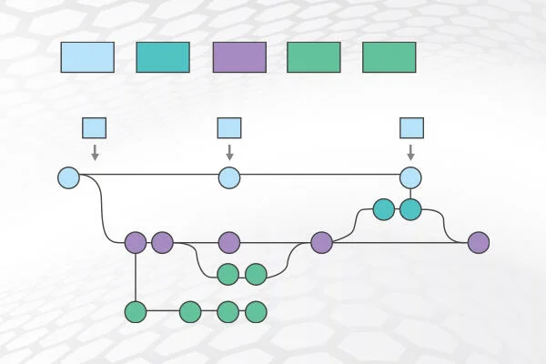

# git-for-kids

Basic information to get started with Git for kids and their parents.

Open a command line.

Type `git clone https://github.com/cophyteam/git-for-kids`

If it does not work, install [Git](https://git-scm.com/).

Then, check the documents of this repository, especially Sotiris' [Git_101.md](Git_101.md).

No more excuse! 😋

You may also check one of these links

-   https://crnl-lab.github.io/cluster-guidelines/git_presentation.html

-   https://crnl-lab.github.io/cluster-guidelines/help_github.html

-   https://agripongit.vincenttunru.com/

<<<<<<< HEAD
-   <http://git-school.github.io/visualizing-git/>

-   [https://www.atlassian.com/git](https://www.atlassian.com/git/glossary#commands) (incredibly complete resource)

Example images displayed from the ./img folder!

=======
-   http://git-school.github.io/visualizing-git/
>>>>>>> parent of 0ef7adf (image)
